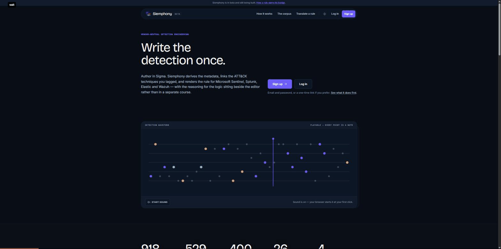
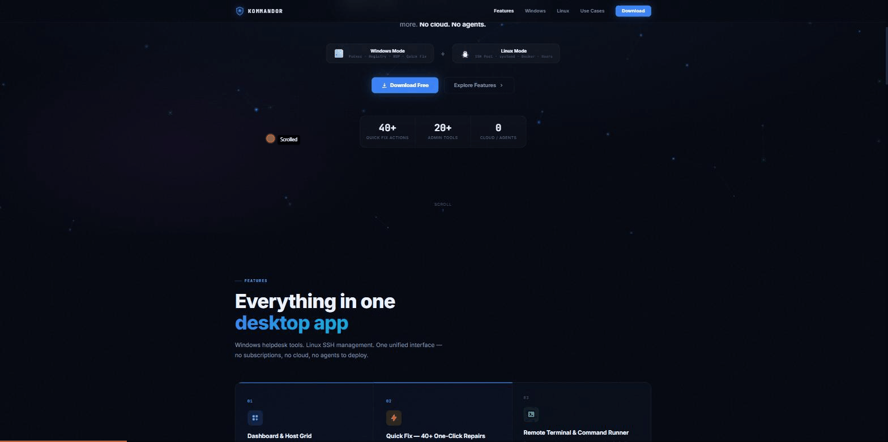
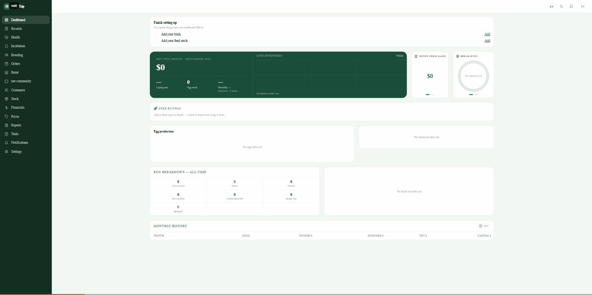
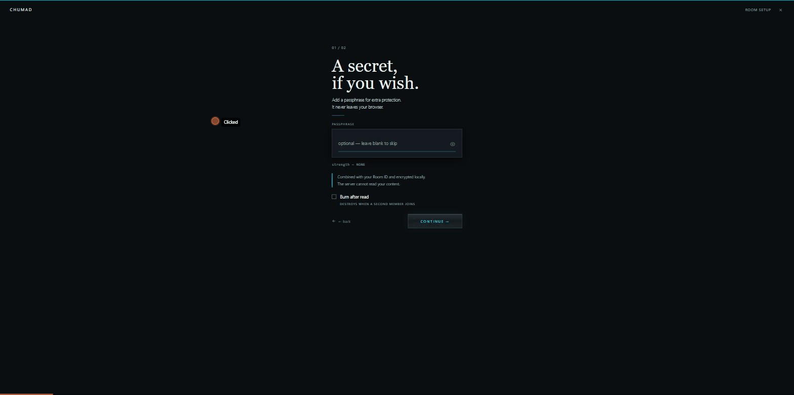

# Hi, I'm Ramil 👋

 

**Security Engineer** — Detection, Vulnerability & Cloud Operations · New Jersey

10 years across help desk, systems support, and security engineering — currently running vulnerability management and detection operations at a global bank, chasing critical findings across 3,000+ assets so nobody else has to find them the hard way. I build the tooling that removes the manual step: a fleet remediation script instead of RDP'ing into hundreds of boxes one at a time, a MITRE ATT&CK technique turned into a tested detection rule, a vulnerability export turned into a dashboard a team actually opens every morning instead of a spreadsheet nobody reads. Somewhere around year three of "have you tried turning it off and on again," I got tired of asking and just automated the part where I ask.

*Vulnerability Management · Detection Engineering · Alert Tuning · Threat Hunting · Incident Response & Forensics · Cloud Security · IAM · EDR · SIEM Engineering · Security Automation · GRC & Compliance*

**Day job runs on:** Microsoft Sentinel, Tenable Nessus & Qualys, Azure Entra ID, SCCM & Intune, across 3,000+ Windows & macOS endpoints.

---

## 🔧 Featured Projects

### [US Infra Vulnerability Dashboard](https://github.com/ramilnamazov/VulnManagment_Powerbi) — [live demo](https://ramilnamazov.github.io/VulnManagment_Powerbi/)
Interactive, Power BI–styled vulnerability management dashboard shipped as a single self-contained HTML file — click-to-filter KPIs, cross-page filter persistence, CISA KEV tracking, and a regulatory scorecard mapped to FedRAMP / NIST SP 800-53 / CMMC 2.0 / OSFI B-13 / FFIEC.

`HTML5` `CSS3` `vanilla JS` `zero dependencies`

### [Siemphony Detection Corpus](https://github.com/ramilnamazov/siemphony-detections) — [live product](https://www.siemphony.com)
400 machine-authored, adversarially reviewed Sigma detection rules covering 402 MITRE ATT&CK techniques — each translated to Splunk SPL, Microsoft Sentinel KQL, Elastic ES|QL, and Wazuh where the backend can actually express it. Six techniques are left with no rule at all, on purpose, with the gap documented rather than papered over. The rules ship free on GitHub; siemphony.com is the live product — author a rule in Sigma, get every SIEM dialect back with the ATT&CK mapping and reasoning attached.

`Sigma` `MITRE ATT&CK` `Splunk SPL` `Sentinel KQL` `Elastic ES|QL` `Wazuh`

### [FleetPatch](https://github.com/ramilnamazov/fleetpatch)
Single-file Windows GUI tool that discovers, plans, executes, and verifies remote Java remediation across a fleet of workstations over PsExec and admin shares — no agent, verified by SHA-256 after every replace.

`Python` `tkinter` `PsExec`

### [PWDTYPER](https://github.com/ramilnamazov/PWDTYPER)
AES-256 encrypted credential vault that types credentials into any window via simulated keystrokes — built for Remote Desktop sessions where clipboard paste is blocked or unreliable.

`Python` `AES-256` `Windows`

### [Kommandor](https://github.com/ramilnamazov/kommandor-releases) — [live site](https://kommandor-website.vercel.app/)
Agentless Windows & Linux fleet management — no cloud, no agents to deploy. Windows side runs PsExec-based remote commands, a live host grid with ping status, 40+ one-click Quick Fix templates, and a full system toolkit (registry, services, event logs, certs, scheduled tasks). Linux side holds a persistent SSH connection pool across servers for package/service/firewall/container/cron management. Every action — command, fix, deploy — writes to a local audit database with a timestamp and result.

`Python` `PsExec` `SSH` `Windows & Linux` `Local audit log`

### Security Labs — [Azure SOC / HoneyNet](https://github.com/ramilnamazov/Azure-Soc) & [AD + Atomic Red Team + Splunk](https://github.com/ramilnamazov/Atomic-Red-Project-)
Hands-on purple-team environments: a live Azure honeynet feeding a SOC pipeline, and an Active Directory lab instrumented with Splunk to detect Atomic Red Team–simulated attacks.

`Azure` `Splunk` `Active Directory` `Atomic Red Team`

---

## 🚀 Also shipped — outside security

Products built and shipped end-to-end, not portfolio pieces — real users, real infrastructure.

### [Tsip Tsip](https://tsiptsip.com) — Poultry Farm Management
SaaS for small poultry farms to run the business, not just log it: flock and incubation tracking, egg production and breakdown, feed-stock runway, orders, a customer bazaar, and P&L reporting down to break-even, in one dashboard.

`SaaS` `Multi-tenant` `Financial reporting`

### [Chumad](https://www.chumad.com) — Private. Instant. Gone.
Ephemeral, client-side-encrypted sharing — clipboard drops, chat, and invite-only circles, built so the server has nothing worth subpoenaing. A room's optional passphrase is combined with its Room ID and encrypted **entirely in-browser** — it's never transmitted, so Chumad's own servers cannot decrypt a room even under compulsion. Every room carries a hard TTL (15 min / 1 hr / 24 hr) enforced server-side with no recovery path once it lapses, and an optional "burn after read" mode destroys the content the moment a second participant joins — a one-time read, not just a timer. Ending a session live-wipes the room for every connected participant, not just the initiator.

`Client-side AES` `Zero-knowledge server` `WebSocket live sync` `TTL self-destruct`

---

## 🧭 Skills → Projects

| Skill | Demonstrated in |
|---|---|
| Detection engineering (Sigma / MITRE ATT&CK) | [siemphony-detections](https://github.com/ramilnamazov/siemphony-detections) |
| Vulnerability management & reporting | [VulnManagment_Powerbi](https://github.com/ramilnamazov/VulnManagment_Powerbi) |
| SIEM implementation & log analysis | [Azure-Soc](https://github.com/ramilnamazov/Azure-Soc) |
| Fleet / endpoint remediation tooling | [fleetpatch](https://github.com/ramilnamazov/fleetpatch) |
| Secure credential handling & automation | [PWDTYPER](https://github.com/ramilnamazov/PWDTYPER) |
| Active Directory & purple-teaming | [Atomic-Red-Project-](https://github.com/ramilnamazov/Atomic-Red-Project-) |

---
## 🛠️ Tools & Technologies

**SIEM & Detection**

    

**Endpoint & EDR**

      

**Vulnerability Management**

    

**Identity & Access**

        

**Cloud & Email Security**

   

**Scripting, Automation & Threat Analysis**

       

**Compliance & Reporting**

        

---

## 📜 Certifications

      

---

## 🎓 Education & Languages

B.A., Business Administration / International Relations — Yalova University, 2015  

English · Russian · Turkish (fluent) · Georgian (native)

---

## 📫 Contact

  
